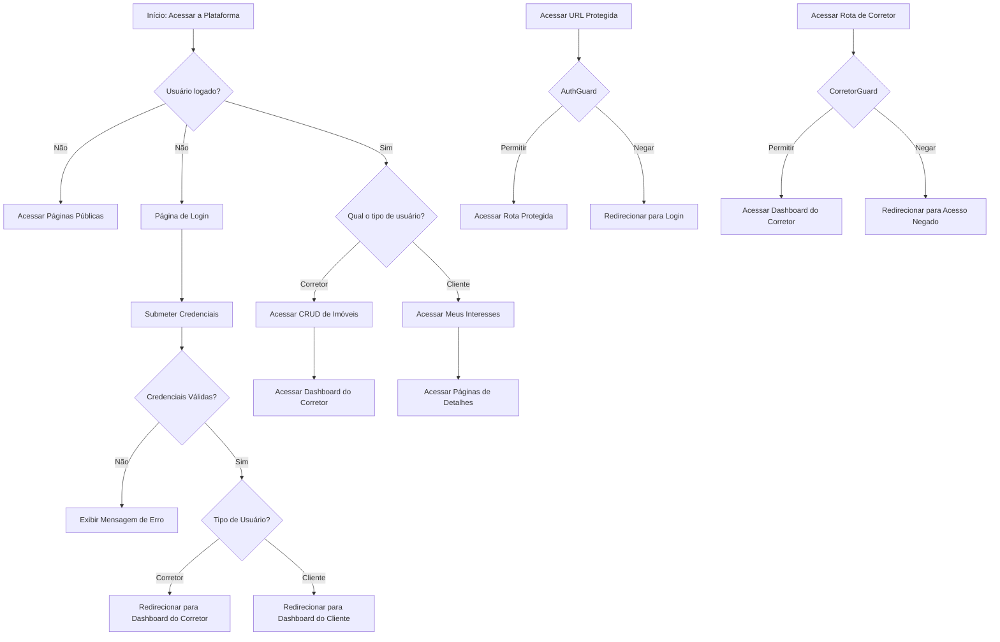
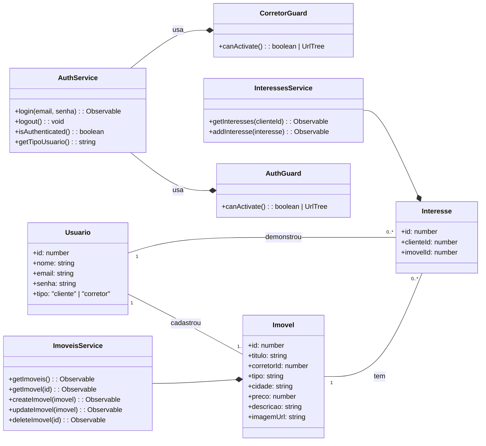
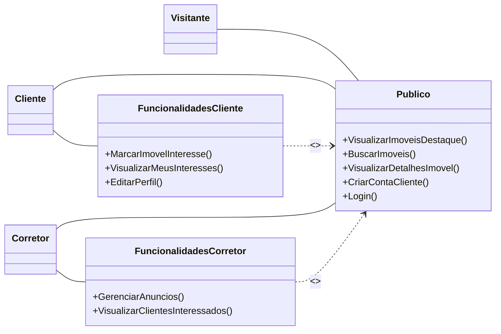

*Diagrama de Fluxo*

```mermaid
graph TD
    A[Início: Acessar a Plataforma] --> B{Usuário logado?};

    B -- Não --> C[Acessar Páginas Públicas];
    B -- Não --> D[Página de Login];
    D --> E[Submeter Credenciais];
    E --> F{Credenciais Válidas?};
    F -- Não --> G[Exibir Mensagem de Erro];
    F -- Sim --> H{Tipo de Usuário?};
    H -- Corretor --> I[Redirecionar para Dashboard do Corretor];
    H -- Cliente --> J[Redirecionar para Dashboard do Cliente];

    B -- Sim --> K{Qual o tipo de usuário?};
    K -- Corretor --> L[Acessar CRUD de Imóveis];
    L --> M[Acessar Dashboard do Corretor];
    K -- Cliente --> N[Acessar Meus Interesses];
    N --> O[Acessar Páginas de Detalhes];

    P[Acessar URL Protegida] --> Q{AuthGuard};
    Q -- Permitir --> R[Acessar Rota Protegida];
    Q -- Negar --> S[Redirecionar para Login];

    T[Acessar Rota de Corretor] --> U{CorretorGuard};
    U -- Permitir --> V[Acessar Dashboard do Corretor];
    U -- Negar --> W[Redirecionar para Acesso Negado];
```

*Diagrama de Classes*

```mermaid
classDiagram
    direction LR
    class Usuario {
        +id: number
        +nome: string
        +email: string
        +senha: string
        +tipo: "cliente" | "corretor"
    }

    class Imovel {
        +id: number
        +titulo: string
        +corretorId: number
        +tipo: string
        +cidade: string
        +preco: number
        +descricao: string
        +imagemUrl: string
    }

    class Interesse {
        +id: number
        +clienteId: number
        +imovelId: number
    }

    class AuthService {
        +login(email, senha): Observable<any>
        +logout(): void
        +isAuthenticated(): boolean
        +getTipoUsuario(): string
    }

    class ImoveisService {
        +getImoveis(): Observable<Imovel[]>
        +getImovel(id): Observable<Imovel>
        +createImovel(imovel): Observable<Imovel>
        +updateImovel(imovel): Observable<Imovel>
        +deleteImovel(id): Observable<any>
    }

    class InteressesService {
        +getInteresses(clienteId): Observable<Interesse[]>
        +addInteresse(interesse): Observable<Interesse>
    }

    class AuthGuard {
        +canActivate(): boolean | UrlTree
    }

    class CorretorGuard {
        +canActivate(): boolean | UrlTree
    }

    Usuario "1" -- "1..*" Imovel: cadastrou
    Imovel "1" -- "0..*" Interesse: tem
    Usuario "1" -- "0..*" Interesse: demonstrou
    
    AuthService --* AuthGuard: usa
    AuthService --* CorretorGuard: usa
    ImoveisService --* Imovel
    InteressesService --* Interesse
```

*Diagrama de Casos de Uso*

```mermaid
classDiagram
    direction LR
    class Visitante
    class Cliente
    class Corretor

    class Publico {
        +VisualizarImoveisDestaque()
        +BuscarImoveis()
        +VisualizarDetalhesImovel()
        +CriarContaCliente()
        +Login()
    }

    class FuncionalidadesCliente {
        +MarcarImovelInteresse()
        +VisualizarMeusInteresses()
        +EditarPerfil()
    }

    class FuncionalidadesCorretor {
        +GerenciarAnuncios()
        +VisualizarClientesInteressados()
    }

    Visitante -- Publico
    Cliente -- Publico
    Cliente -- FuncionalidadesCliente
    Corretor -- Publico
    Corretor -- FuncionalidadesCorretor

    FuncionalidadesCliente ..> Publico : <<inclui>>
    FuncionalidadesCorretor ..> Publico : <<inclui>>
```
